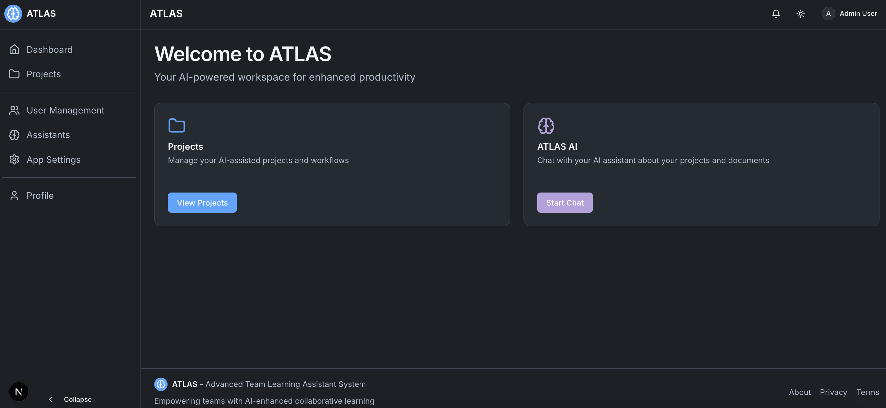
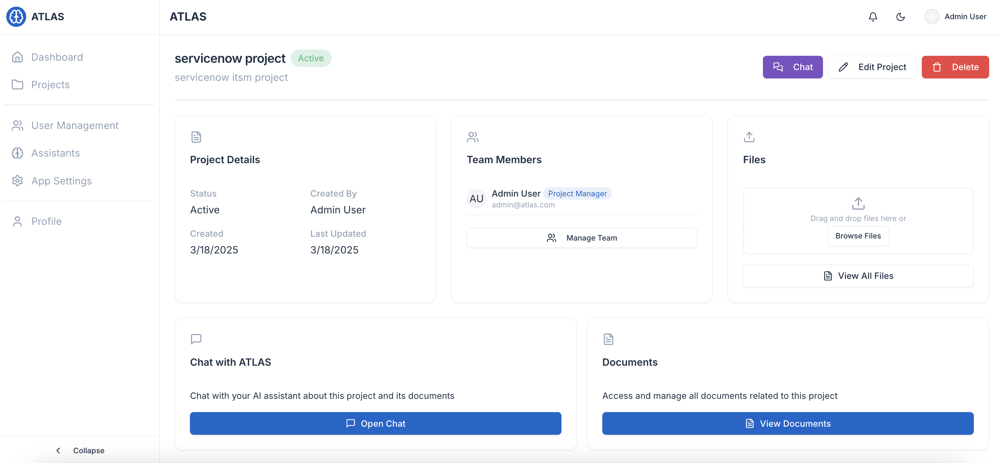
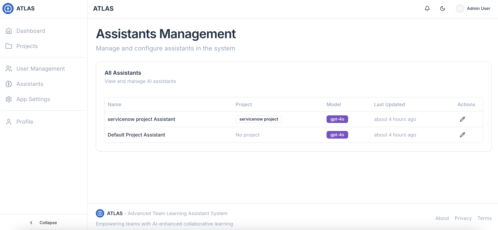
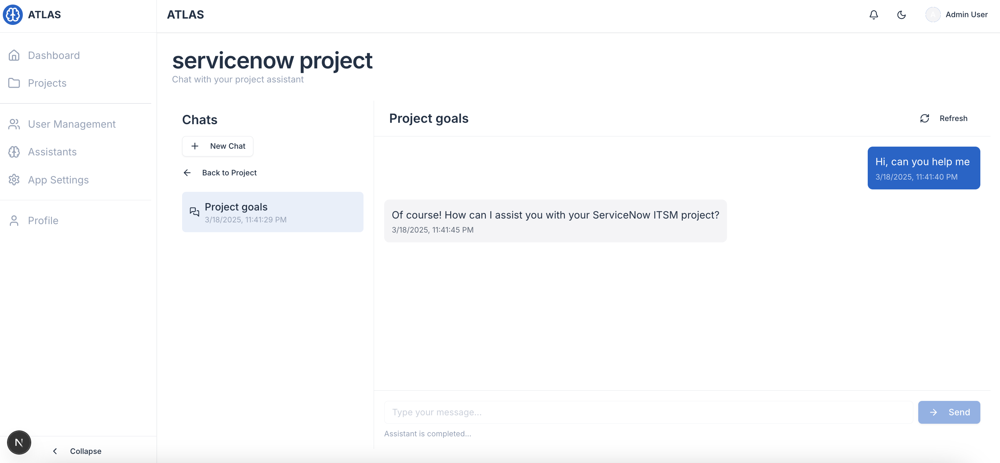
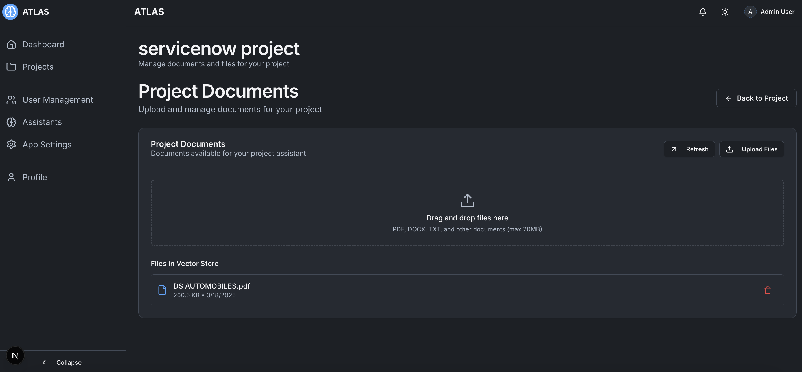

# ATLAS - Advanced Team Learning Assistant System

This is a Next.js application that provides an AI-powered workspace for enhanced team learning and productivity.


## Getting Started

### Local Development

First, run the development server:

```bash
npm run dev
# or
yarn dev
# or
pnpm dev
# or
bun dev
```

Open [http://localhost:3000](http://localhost:3000) with your browser to see the result.

### Docker Deployment (Recommended)

The easiest way to deploy ATLAS is using Docker:

1. Make sure Docker and Docker Compose are installed
2. Run the automated setup script:
   ```bash
   ./rebuild-docker.sh
   ```
3. Access the application at http://localhost:3000

For detailed Docker deployment instructions, see [DOCKER.md](DOCKER.md).

## Features

- AI-powered document analysis and insights
- Context-aware AI assistance
- Custom assistant for each project
- Dark Mode
- User role management
- OPENAI API integration
- Prisma ORM
- NextJS App Router
- Docker containerization
- PostgreSQL database
- NextAuth authentication
- Tailwind CSS
- Shadcn UI

## Screenshots

### Dashboard

*The main dashboard provides an overview of your projects and recent activities.*

### Project View

*Detailed project view with AI-assisted features and team collaboration tools.*

### Assistants Management

*Create and manage multiple AI-assisted projects with custom assistant features.*

### AI Chat Interface

*The AI assistant provides context-aware responses based on your project data.*

### Document Analysis

*Upload and analyze documents with AI-powered insights.*

## Learn More

To learn more about Next.js, take a look at the following resources:

- [Next.js Documentation](https://nextjs.org/docs) - learn about Next.js features and API.
- [Learn Next.js](https://nextjs.org/learn) - an interactive Next.js tutorial.

## Database

ATLAS uses PostgreSQL for data storage. See [DATABASE.md](./DATABASE.md) for details on the schema.

## Contributing

Contributions are welcome! Please feel free to submit a Pull Request.

## License

[MIT](LICENSE)
